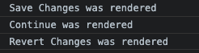

# My Note

## basic 

### useState

> useState에 값(혹은 객체)을 넣은 것과 콜백 함수를 넣은 것은 어떻게 다른가?
 
- 값을 넣었을 때: state가 값으로 대체

- 함수 넣었을 때: state를 입력 받고 처리하여 반환한 값으로 대체

- [예제 코드 블럭](https://github.com/dev-chloe/hangout-start-react-with-nomad/blob/0d0a1cd17535787331d4baf0c4da8eac4c32fbc9/basic/index.html#L17-L43)

- 예제 실행 결과  

  

- Ref. [React.JS docs: Hooks intro](https://ko.reactjs.org/docs/hooks-intro.html)
  & [**useState 동작의 포인트**](https://ko.reactjs.org/docs/hooks-faq.html#:~:text=%EC%9D%B4%EB%8A%94%20state%20%EB%B3%80%EC%88%98%EB%A5%BC%20%EC%97%85%EB%8D%B0%EC%9D%B4%ED%8A%B8%ED%95%A0%20%EB%95%8C%20%EA%B7%B8%20%EA%B0%92%EC%9D%84%20%EB%8C%80%EC%B2%B4%ED%95%98%EA%B8%B0%20%EB%95%8C%EB%AC%B8%EC%9E%85%EB%8B%88%EB%8B%A4.%20%EC%9D%B4%EA%B2%83%EC%9D%80%20%EC%97%85%EB%8D%B0%EC%9D%B4%ED%8A%B8%EB%90%9C%20%ED%95%84%EB%93%9C%EB%A5%BC%20%EA%B0%9D%EC%B2%B4%EC%97%90%20%EB%B3%91%ED%95%A9%ED%95%98%EB%8A%94%20class%EC%9D%98%20this.setState%EC%99%80%20%EB%8B%A4%EB%A6%85%EB%8B%88%EB%8B%A4.)


### props

> 어떠한 값을 컴포넌트에게 전달해줄 때 사용

- [예제 코드1](https://github.com/dev-chloe/hangout-start-react-with-nomad/blob/7f870ad874ca06339bfb5a4ab622aa56c8cb2123/basic/index.html#L17-L36)

- [예제 코드2(주로 쓰이는 방법)](https://github.com/dev-chloe/hangout-start-react-with-nomad/blob/9b04a4e169de99549048fad85e41d775f4d7a92f/basic/index.html#L17-L30)

#### React.memo

> 변화된 props만 랜더링 한다.

- [예제 코드](https://github.com/dev-chloe/hangout-start-react-with-nomad/blob/9b04a4e169de99549048fad85e41d775f4d7a92f/basic/index.html#L34-L43)

  > React memo 사용 전 랜더된 후 버튼 클릭

  

  > React memo 사용 후 랜더된 후 버튼 클릭
  
  


- Ref. [React.JS docs: props](https://ko.reactjs.org/docs/components-and-props.html)


#### React.StrictMode

> 애플리케이션 내의 잠재적인 문제를 알아내기 위한 도구  
> Strict 모드는 개발 모드에서만 활성화되기 때문에, 프로덕션 빌드에는 영향을 끼치지 않는다


> render가 두 번씩이나??

```javascript
  // App.js
  
  function App() {
    const [counter, setValue] = useState(0);
    const onClick = () => setValue((prev) => prev + 1);
    console.log("i run all the time");
    useEffect(() => {
      console.log("CALL THE API")
    }, []);
    return (
      <div>
        <h1 className={styles.title}>{counter}</h1>
        <Button text={"click me"} onClick={onClick}/>
      </div>
    );
  }
``` 
```javascript
  // index.js
  // StrictMode일 때

  const root = ReactDOM.createRoot(document.getElementById('root'));
  root.render(
    <React.StrictMode>
      <App />
    </React.StrictMode>
  );
```
> 두 번씩 render 되는 것 처럼 보이지만 React Developer Tools을 이용하여 확인해 보면 예상하지 못한 문제 발상 방지를 위한 검사 후 실제 render가 되는 것이 확인 가능하다

  


  

```javascript
  // index.js
  // StrictMode 아닐 때

  const root = ReactDOM.createRoot(document.getElementById('root'));
  root.render(
    <>
      <App />
    </>
  );
```
> render 아무런 확인 없이 진행 된다

  

- Ref. [React.JS docs: StrictMode](https://ko.reactjs.org/docs/strict-mode.html)
